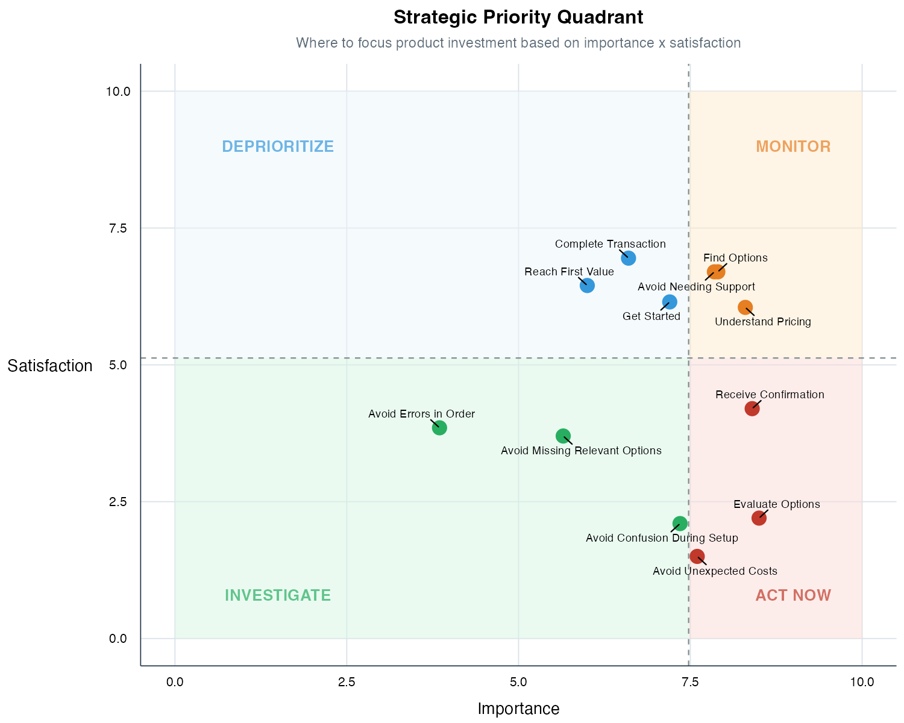
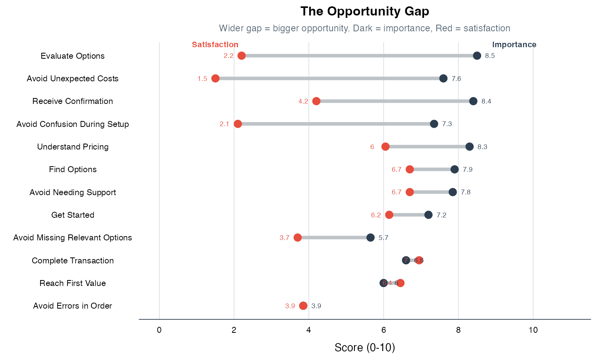
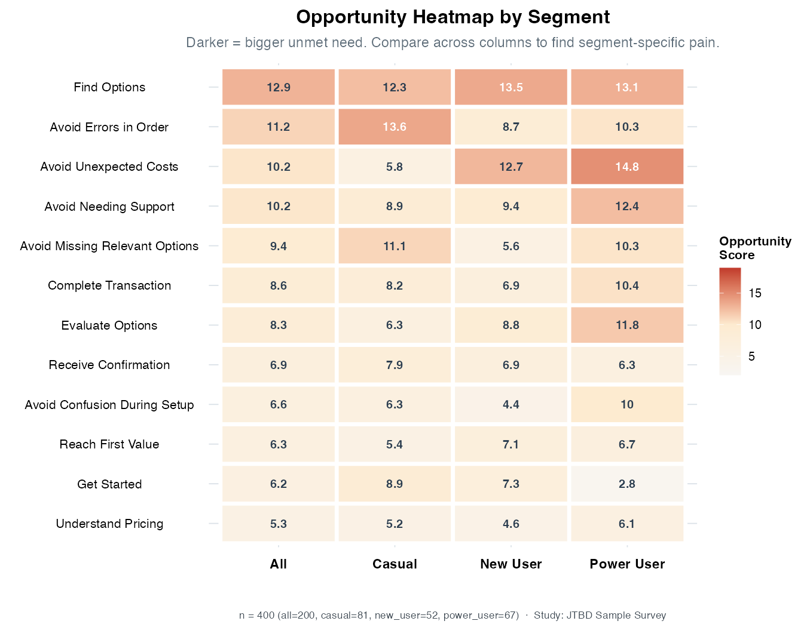
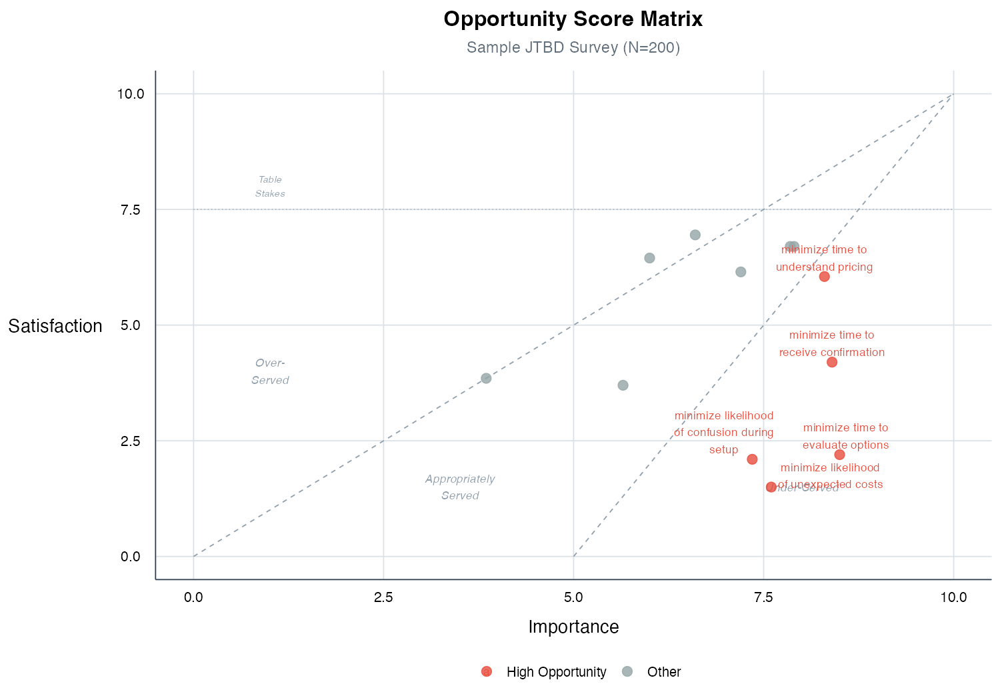
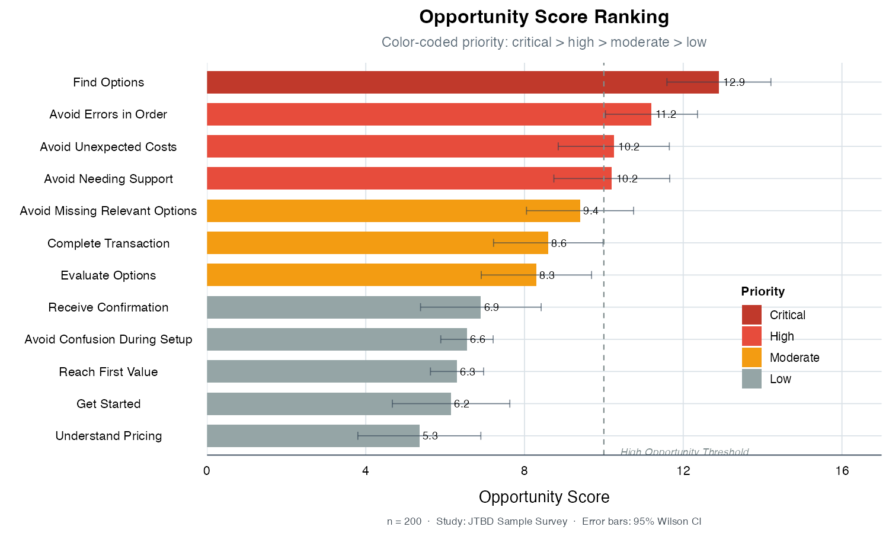
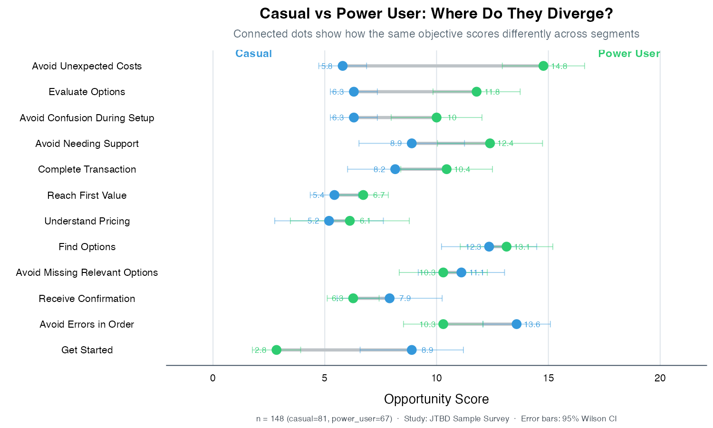
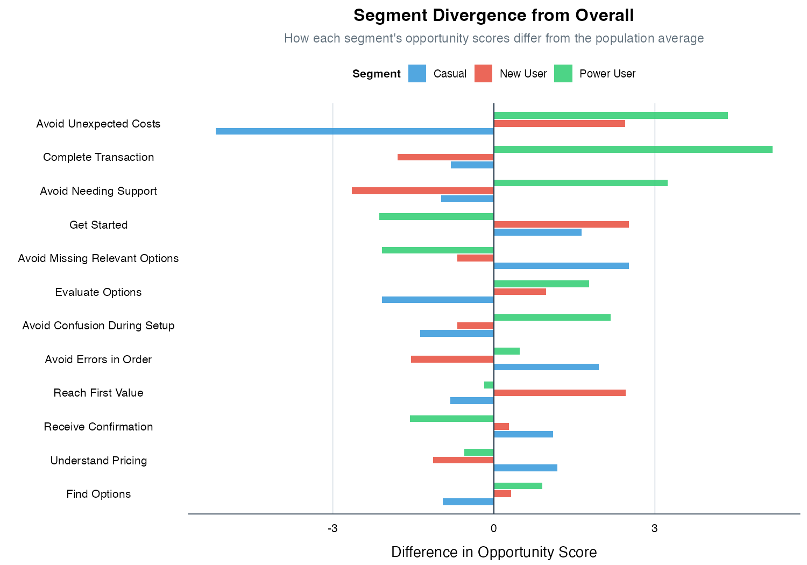
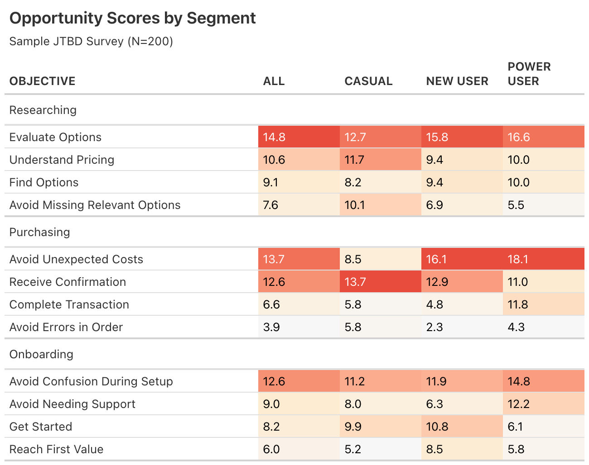
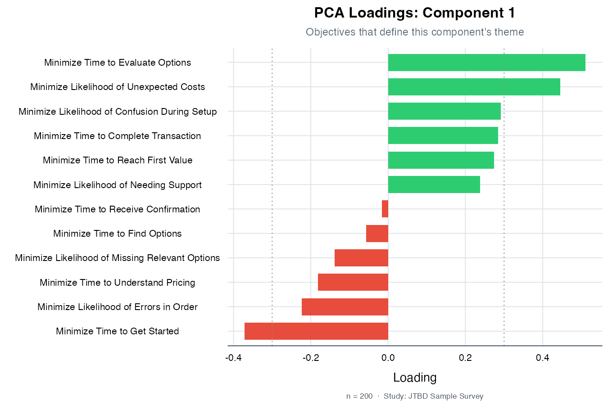
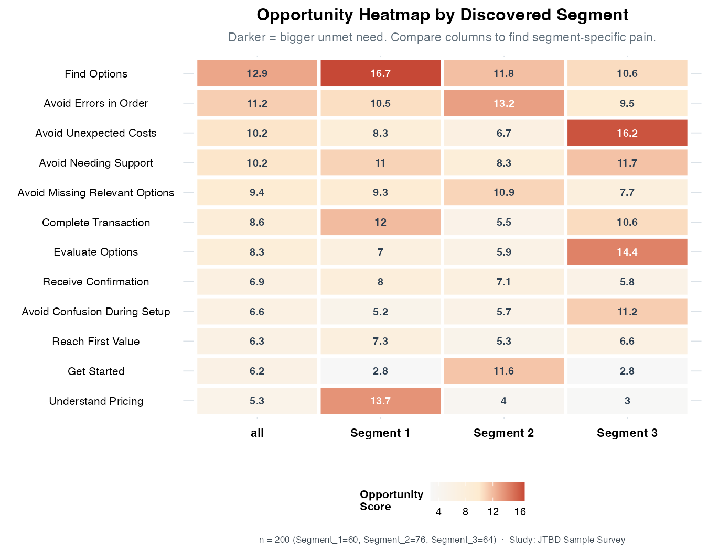

# jtbdtools 

<!-- badges: start -->
[](https://lifecycle.r-lib.org/articles/stages.html#experimental)
[](https://github.com/charlesrogers/jtbdtools/actions/workflows/R-CMD-check.yaml)
[](https://opensource.org/licenses/MIT)
<!-- badges: end -->

**Quantitative Jobs-to-Be-Done analysis in R.** Opportunity scoring, segment comparison, and publication-ready visualizations using the Outcome-Driven Innovation methodology.

## The Formula

```
opportunity = importance + max(0, importance - satisfaction)
```

When importance exceeds satisfaction, the gap amplifies the score. When users are already satisfied, opportunity equals importance (the floor). Scores range 0-20; anything above 10 is a high-opportunity outcome.

---

## What You Get

### Strategic Priority Quadrant

Where should you focus? High importance + low satisfaction = act now.



### The Opportunity Gap

See the gap between what users need and what they have. Wider gap = bigger opportunity.



### Opportunity Heatmap by Segment

Spot segment-specific pain at a glance. Power users are underserved on "Avoid Unexpected Costs" (18.1) while casuals barely feel it (8.5).



### Opportunity Matrix with Zone Annotations

The classic ODI scatter plot with Under-Served, Appropriately-Served, Over-Served, and Table Stakes zones:



### Priority Ranking

All objectives ranked by opportunity score, color-coded by priority tier:



### Segment Head-to-Head (Cleveland Dot Plot)

Compare two segments side by side. Where do casual users and power users diverge?



### Segment Divergence

How does each segment differ from the overall population? Instantly spot who's over- and under-served:



### Publication-Ready Tables

Formatted gt tables with heat-mapped scores, ready for stakeholder decks:



---

## Outcome-Based Segmentation (PCA + K-Means)

Discover segments from the data itself — groups of people with shared unmet needs that don't map to demographics. This is the core of [Outcome-Driven Innovation](https://redlandroad.com/outcome-driven-innovation/).

```r
result <- jtbd_segment(jtbd_sample, n_clusters = 3)
```

### Step 1: Find Outcome Themes (PCA)

PCA finds combinations of objectives that vary together, revealing broader customer themes. Kaiser rule retains components with eigenvalue > 1:


The loadings show which objectives define each theme — Component 1 is driven by "Avoid Unexpected Costs" and "Evaluate Options":



### Step 2: Find the Right Number of Clusters

Evaluate multiple cluster solutions. Silhouette score measures separation quality, WCSS measures tightness:


### Step 3: Discover Segments

K-Means clusters respondents in PCA space. Each color is a discovered segment with distinct unmet needs:


### Step 4: Profile the Segments

The payoff — opportunity scores per discovered segment with statistical significance. Segment 3 has extreme unmet needs on purchasing (18.3) while Segment 1 is relatively satisfied (4.8):



These discovered segments plug directly into all existing comparison functions — Cleveland plots, divergence charts, gt tables, and significance testing all work automatically.

---

## Quick Start

```r
# install.packages("pak")
pak::pak("charlesrogers/jtbdtools")

library(jtbdtools)
data(jtbd_sample)

# Calculate opportunity scores
scores <- get_jtbd_scores(jtbd_sample)

# Compare across segments with statistical significance
comparison <- get_jtbd_scores.comparison(jtbd_sample, "segment", test_sig = TRUE)

# Visualize
plot_opportunity_matrix(scores, show_zones = TRUE)
```

### From Qualtrics to Insights in 3 Lines

```r
# Import directly from Qualtrics CSV
ready <- prep_qualtrics("my_survey.csv",
  job_steps = list(researching = 1:4, purchasing = 5:8),
  segment_col = "Q_segment"
)

# Score with significance testing
scores <- get_jtbd_scores(ready)
comparison <- get_jtbd_scores.comparison(ready, "Q_segment", test_sig = TRUE)
```

Also works with any CSV via `prep_survey()` — just point it at your importance and satisfaction columns.

## Functions

| Category | Function | Description |
|----------|----------|-------------|
| **Scoring** | `get_jtbd_scores()` | Calculate imp/sat/opp scores for a dataset |
| | `get_jtbd_scores.comparison()` | Compare scores across segments |
| | `get_jtbd_scores.pairwise()` | Head-to-head comparison of two segments |
| | `calculate_opportunity_score()` | Core ODI formula |
| **Visualization** | `plot_opportunity_matrix()` | Importance x Satisfaction scatter with zones |
| | `plot_cleveland()` | Lollipop chart for segment comparison |
| | `plot_this.graph.rel_score()` | Relative score bump chart |
| | `plot_this.graph.abs_score()` | Absolute score bump chart |
| | `theme_jtbd()` | Consistent ggplot2 theme for all charts |
| | `jtbd_colors()` | Named color palette |
| **Tables** | `gt_theme_jtbd()` | Branded gt table theme with heat mapping |
| | `theme.job_step()` | Publication-ready gt table |
| | `create.job_step.table()` | Filter + format + save as PNG |
| | `create.pct.table()` | Frequency table with bar charts |
| **Import** | `prep_qualtrics()` | Qualtrics CSV to analysis-ready in one call |
| | `prep_survey()` | Universal data prep for any source |
| | `read_qualtrics()` | Read Qualtrics CSV (handles metadata rows) |
| | `detect_imp_sat()` | Auto-detect importance/satisfaction columns |
| | `validate_jtbd_data()` | Check data format before scoring |
| **Segmentation** | `jtbd_segment()` | Full ODI segmentation pipeline (one call) |
| | `jtbd_cluster()` | K-Means clustering on opportunity data |
| | `jtbd_pca()` | PCA with Kaiser rule component selection |
| | `jtbd_find_k()` | Evaluate 2-6 cluster solutions (elbow + silhouette) |
| | `jtbd_cluster_profile()` | T2B scores per discovered cluster |
| | `jtbd_feature_matrix()` | Respondent x objective opportunity matrix |
| **Cluster Viz** | `plot_pca_biplot()` | Respondents in PCA space, colored by cluster |
| | `plot_cluster_heatmap()` | Opportunity heatmap across clusters |
| | `plot_pca_scree()` | Scree plot with Kaiser line |
| | `plot_pca_loadings()` | Component loading bar chart |
| | `plot_elbow()` | Elbow + silhouette evaluation plot |
| **Stat Sig** | `test_segment_significance()` | Wilcoxon rank-sum test between segments |
| **Legacy Data Prep** | `prep_data()` | SPSS data cleaning pipeline |
| | `build_imp_column_names()` | Rename columns to `imp__step.objective` |
| | `build_sat_column_names()` | Rename columns to `sat__step.objective` |
| **Analysis** | `get.normalized_scores()` | Min-max normalize within segments |
| | `get.percent_of_max()` | Percent-of-segment-max scoring |
| | `get_jtbd_segment.comp.ordinal()` | Rank-based segment comparison |

## Data Format

Your data needs columns in this format:

```
imp__job_step.objective_name    # importance (factor, 1-5)
sat__job_step.objective_name    # satisfaction (factor, 1-5)
```

Example:
- `imp__researching.minimize_time_to_evaluate_options`
- `sat__researching.minimize_time_to_evaluate_options`

See `?jtbd_sample` for a complete working dataset and `vignette("data-preparation")` for SPSS import instructions.

## Methodology

Based on Tony Ulwick's [Outcome-Driven Innovation](https://www.amazon.com/What-Customers-Want-Outcome-Driven-Breakthrough/dp/0071408673). The package:

1. Converts Likert-scale (1-5) survey responses to 0-10 scores using **top-2-box** scoring (% rating 4 or 5)
2. Applies the ODI formula: `opportunity = importance + max(0, importance - satisfaction)`
3. Compares scores across user segments to identify where specific groups are underserved
4. Generates publication-ready visualizations and tables

## License

MIT
