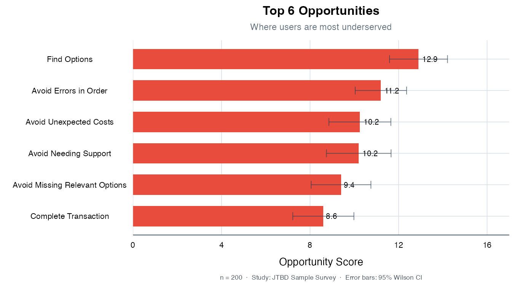

# jtbdtools 

<!-- badges: start -->
[](https://lifecycle.r-lib.org/articles/stages.html#experimental)
[](https://github.com/charlesrogers/jtbdtools/actions/workflows/R-CMD-check.yaml)
[](https://opensource.org/licenses/MIT)
<!-- badges: end -->

**Quantitative Jobs-to-Be-Done analysis in R.** Opportunity scoring, segment comparison, and publication-ready visualizations using the Outcome-Driven Innovation methodology.

## The Formula

The ODI opportunity score measures unmet customer needs:

```
opportunity = importance + max(0, importance - satisfaction)
```

When importance exceeds satisfaction, the gap amplifies the score. When users are already satisfied, opportunity equals importance (the floor). Scores range 0-20; anything above 10 is a high-opportunity outcome.

## What You Get

### Segment comparison tables

Compare opportunity scores across user segments to find where specific groups are underserved:


### Opportunity matrix

The classic ODI scatter plot with zone annotations. High importance + low satisfaction = high opportunity (red). Use `show_zones = TRUE` to add Under-Served / Appropriately-Served / Over-Served reference lines:


### Ranked opportunity scores

Instantly see which outcomes have the highest unmet need:



## Quick Start

```r
# install.packages("pak")
pak::pak("charlesrogers/jtbdtools")

library(jtbdtools)
data(jtbd_sample)

# Calculate opportunity scores
scores <- get_jtbd_scores(jtbd_sample)

# Compare across segments
comparison <- get_jtbd_scores.comparison(jtbd_sample, "segment")

# Visualize
plot_opportunity_matrix(scores)
```

## Functions

| Category | Function | Description |
|----------|----------|-------------|
| **Scoring** | `get_jtbd_scores()` | Calculate imp/sat/opp scores for a dataset |
| | `get_jtbd_scores.comparison()` | Compare scores across segments |
| | `get_jtbd_scores.pairwise()` | Head-to-head comparison of two segments |
| | `calculate_opportunity_score()` | Core ODI formula |
| **Visualization** | `plot_opportunity_matrix()` | Importance x Satisfaction scatter |
| | `plot_cleveland()` | Lollipop chart for segment comparison |
| | `plot_this.graph.rel_score()` | Relative score bump chart |
| | `plot_this.graph.abs_score()` | Absolute score bump chart |
| **Tables** | `gt_theme_jtbd()` | Branded gt table theme |
| | `theme.job_step()` | Publication-ready gt table |
| | `create.job_step.table()` | Filter + format + save as PNG |
| | `create.pct.table()` | Frequency table with bar charts |
| **Data Prep** | `prep_data()` | Full SPSS data cleaning pipeline |
| | `build_imp_column_names()` | Rename columns to `imp__step.objective` |
| | `build_sat_column_names()` | Rename columns to `sat__step.objective` |
| **Analysis** | `get.normalized_scores()` | Min-max normalize within segments |
| | `get.percent_of_max()` | Percent-of-segment-max scoring |
| | `get_jtbd_segment.comp.ordinal()` | Rank-based segment comparison |

## Data Format

Your data needs columns in this format:

```
imp__job_step.objective_name    # importance (factor, 1-5)
sat__job_step.objective_name    # satisfaction (factor, 1-5)
```

Example:
- `imp__researching.minimize_time_to_evaluate_options`
- `sat__researching.minimize_time_to_evaluate_options`

See `?jtbd_sample` for a complete working dataset and `vignette("data-preparation")` for SPSS import instructions.

## Methodology

Based on Tony Ulwick's [Outcome-Driven Innovation](https://www.amazon.com/What-Customers-Want-Outcome-Driven-Breakthrough/dp/0071408673). The package:

1. Converts Likert-scale (1-5) survey responses to 0-10 scores using **top-2-box** scoring (% rating 4 or 5)
2. Applies the ODI formula: `opportunity = importance + max(0, importance - satisfaction)`
3. Compares scores across user segments to identify where specific groups are underserved
4. Generates publication-ready visualizations and tables

## License

MIT
