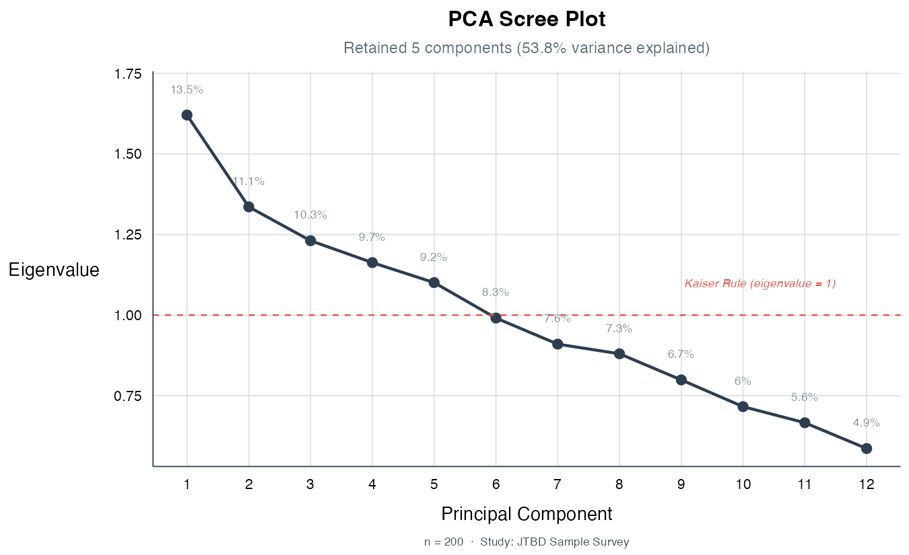
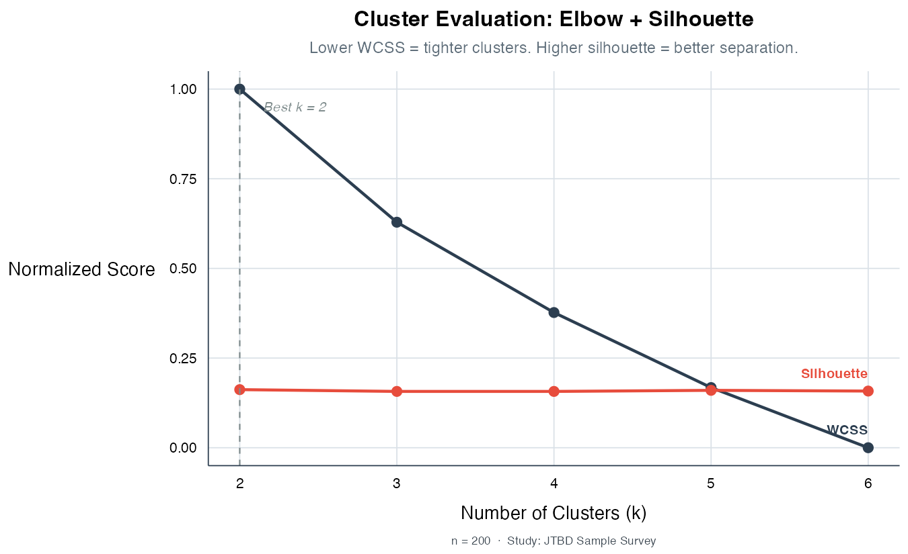
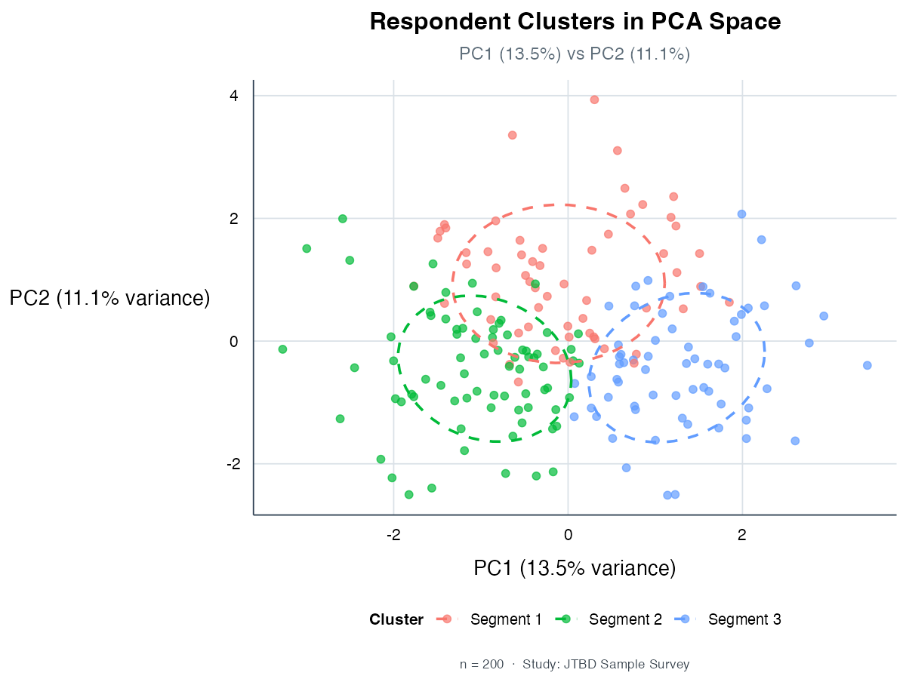
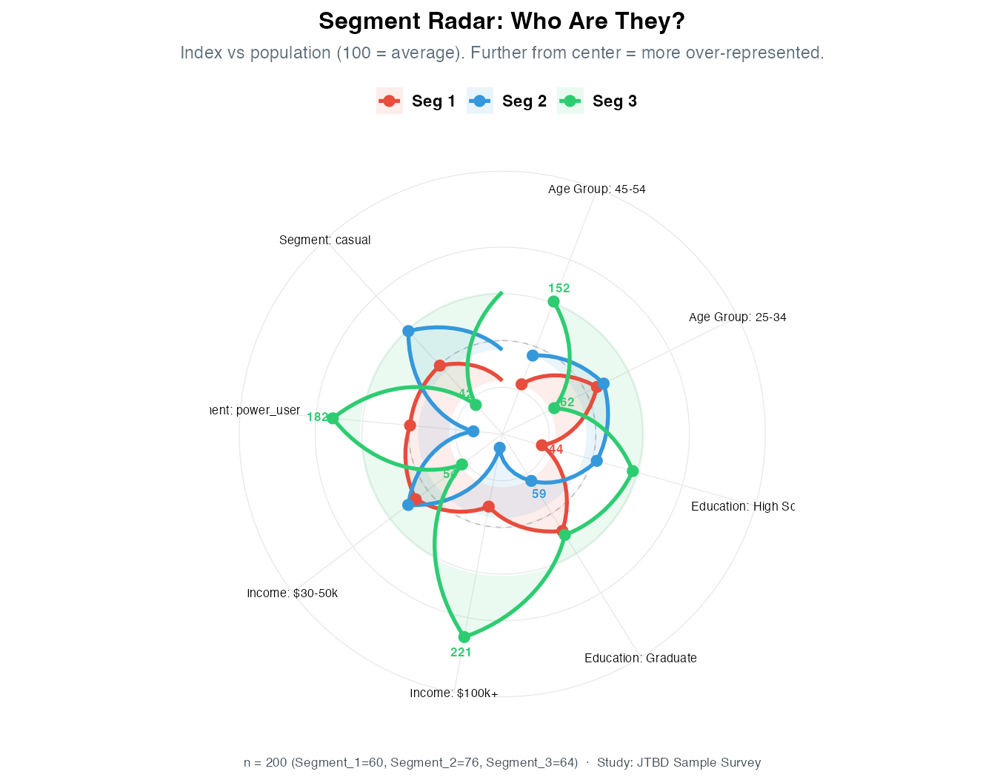
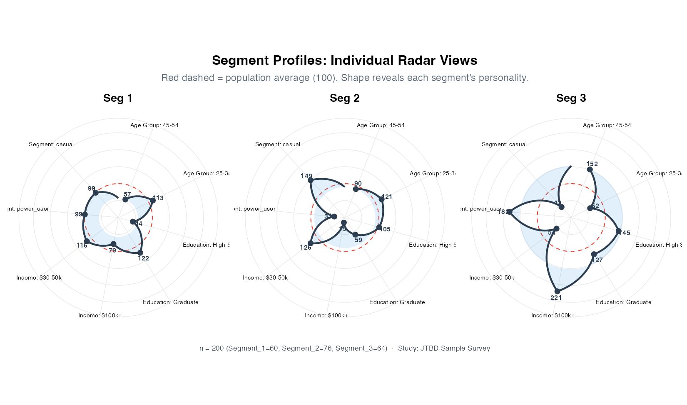
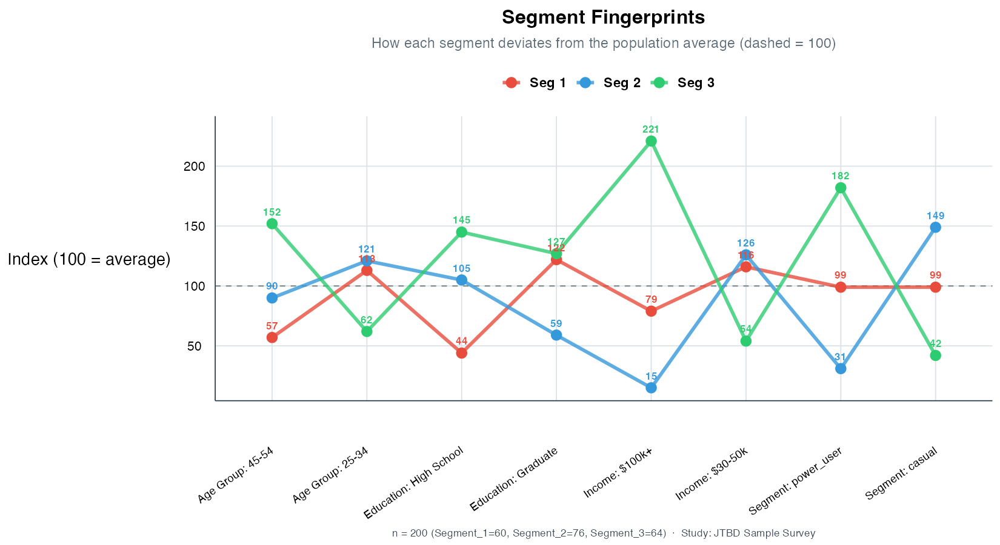
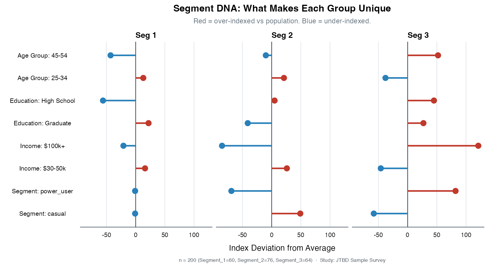
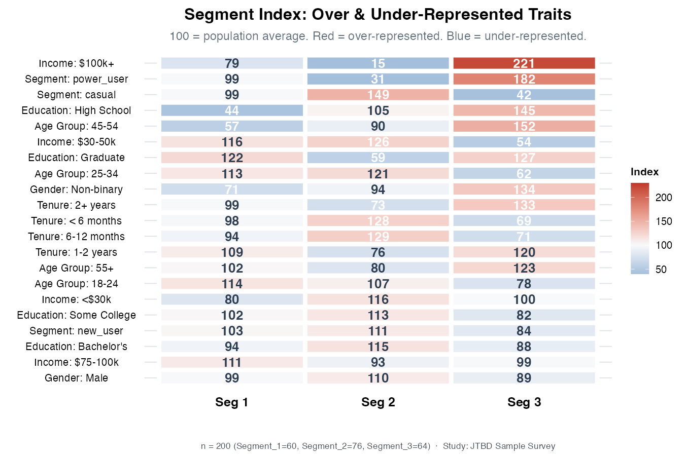
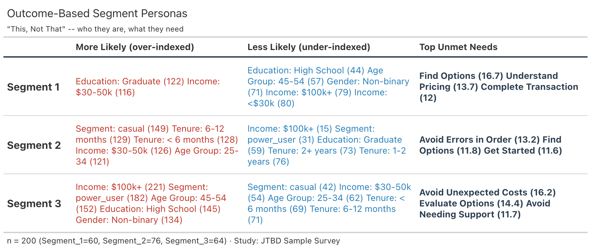

# jtbdtools 

**Quantitative Jobs-to-Be-Done analysis in R.** Opportunity scoring,
segment comparison, and publication-ready visualizations using the
Outcome-Driven Innovation methodology.

## The Formula

    opportunity = importance + max(0, importance - satisfaction)

When importance exceeds satisfaction, the gap amplifies the score. When
users are already satisfied, opportunity equals importance (the floor).
Scores range 0-20; anything above 10 is a high-opportunity outcome.

------------------------------------------------------------------------

## What You Get

### Strategic Priority Quadrant

Where should you focus? High importance + low satisfaction = act now.


### The Opportunity Gap

See the gap between what users need and what they have. Wider gap =
bigger opportunity.


### Opportunity Heatmap by Segment

Spot segment-specific pain at a glance. Power users are underserved on
“Avoid Unexpected Costs” (18.1) while casuals barely feel it (8.5).


### Opportunity Matrix with Zone Annotations

The classic ODI scatter plot with Under-Served, Appropriately-Served,
Over-Served, and Table Stakes zones:


### Priority Ranking

All objectives ranked by opportunity score, color-coded by priority
tier:


### Segment Head-to-Head (Cleveland Dot Plot)

Compare two segments side by side. Where do casual users and power users
diverge?


### Segment Divergence

How does each segment differ from the overall population? Instantly spot
who’s over- and under-served:


### Publication-Ready Tables

Formatted gt tables with heat-mapped scores, ready for stakeholder
decks:


------------------------------------------------------------------------

## Outcome-Based Segmentation (PCA + K-Means)

Discover segments from the data itself — groups of people with shared
unmet needs that don’t map to demographics. This is the core of
[Outcome-Driven
Innovation](https://redlandroad.com/outcome-driven-innovation/).

``` r

result <- jtbd_segment(jtbd_sample, n_clusters = 3)
```

### Step 1: Find Outcome Themes (PCA)

PCA finds combinations of objectives that vary together, revealing
broader customer themes. Kaiser rule retains components with eigenvalue
\> 1:



The loadings show which objectives define each theme — Component 1 is
driven by “Avoid Unexpected Costs” and “Evaluate Options”:


### Step 2: Find the Right Number of Clusters

Evaluate multiple cluster solutions. Silhouette score measures
separation quality, WCSS measures tightness:



### Step 3: Discover Segments

K-Means clusters respondents in PCA space. Each color is a discovered
segment with distinct unmet needs:



### Step 4: Profile the Segments

The payoff — opportunity scores per discovered segment with statistical
significance. Segment 3 has extreme unmet needs on purchasing (18.3)
while Segment 1 is relatively satisfied (4.8):


### Step 5: Explain Who’s In Each Segment

Automatically profile clusters against demographics, behavior, or any
attribute. Chi-squared tests + Cramer’s V find what distinguishes each
group. Six visualization styles:

**Radar Chart** — each segment’s “personality shape” at a glance:



**Individual Radar Views** — one panel per segment, no overlap:



**Segment Fingerprints** — parallel coordinates show where segments
diverge and cross over:



**Segment DNA** — faceted lollipops show each segment’s
over/under-indexed traits:



**Diverging Bar** — ranked by impact, only meaningful deviations:


**Index Heatmap** — the full picture, every attribute x every segment:



### Step 6: Outcome-Based Personas

Auto-generated “This, Not That” persona cards — who they are, what they
need, in one table:



``` r

cl <- jtbd_cluster(jtbd_sample, n_clusters = 3)
prof <- jtbd_profile_segments(cl$data)
opp <- jtbd_cluster_profile(jtbd_sample, cl)
create_persona_table(prof, opp)
```

All discovered segments plug directly into existing comparison functions
— Cleveland plots, divergence charts, gt tables, and significance
testing all work automatically.

------------------------------------------------------------------------

## Quick Start

``` r

# install.packages("pak")
pak::pak("charlesrogers/jtbdtools")

library(jtbdtools)
data(jtbd_sample)

# Calculate opportunity scores
scores <- get_jtbd_scores(jtbd_sample)

# Compare across segments with statistical significance
comparison <- get_jtbd_scores.comparison(jtbd_sample, "segment", test_sig = TRUE)

# Visualize
plot_opportunity_matrix(scores, show_zones = TRUE)
```

### From Qualtrics to Insights in 3 Lines

``` r

# Import directly from Qualtrics CSV
ready <- prep_qualtrics("my_survey.csv",
  job_steps = list(researching = 1:4, purchasing = 5:8),
  segment_col = "Q_segment"
)

# Score with significance testing
scores <- get_jtbd_scores(ready)
comparison <- get_jtbd_scores.comparison(ready, "Q_segment", test_sig = TRUE)
```

Also works with any CSV via
[`prep_survey()`](https://charlesrogers.github.io/jtbdtools/reference/prep_survey.md)
— just point it at your importance and satisfaction columns.

## Functions

| Category | Function | Description |
|----|----|----|
| **Scoring** | [`get_jtbd_scores()`](https://charlesrogers.github.io/jtbdtools/reference/get_jtbd_scores.md) | Calculate imp/sat/opp scores for a dataset |
|  | [`get_jtbd_scores.comparison()`](https://charlesrogers.github.io/jtbdtools/reference/get_jtbd_scores.comparison.md) | Compare scores across segments |
|  | [`get_jtbd_scores.pairwise()`](https://charlesrogers.github.io/jtbdtools/reference/get_jtbd_scores.pairwise.md) | Head-to-head comparison of two segments |
|  | [`calculate_opportunity_score()`](https://charlesrogers.github.io/jtbdtools/reference/calculate_opportunity_score.md) | Core ODI formula |
| **Visualization** | [`plot_opportunity_matrix()`](https://charlesrogers.github.io/jtbdtools/reference/plot_opportunity_matrix.md) | Importance x Satisfaction scatter with zones |
|  | [`plot_cleveland()`](https://charlesrogers.github.io/jtbdtools/reference/plot_cleveland.md) | Lollipop chart for segment comparison |
|  | [`plot_this.graph.rel_score()`](https://charlesrogers.github.io/jtbdtools/reference/plot_this.graph.rel_score.md) | Relative score bump chart |
|  | [`plot_this.graph.abs_score()`](https://charlesrogers.github.io/jtbdtools/reference/plot_this.graph.abs_score.md) | Absolute score bump chart |
|  | [`theme_jtbd()`](https://charlesrogers.github.io/jtbdtools/reference/theme_jtbd.md) | Consistent ggplot2 theme for all charts |
|  | [`jtbd_colors()`](https://charlesrogers.github.io/jtbdtools/reference/jtbd_colors.md) | Named color palette |
| **Tables** | [`gt_theme_jtbd()`](https://charlesrogers.github.io/jtbdtools/reference/gt_theme_jtbd.md) | Branded gt table theme with heat mapping |
|  | [`theme.job_step()`](https://charlesrogers.github.io/jtbdtools/reference/theme.job_step.md) | Publication-ready gt table |
|  | [`create.job_step.table()`](https://charlesrogers.github.io/jtbdtools/reference/create.job_step.table.md) | Filter + format + save as PNG |
|  | [`create.pct.table()`](https://charlesrogers.github.io/jtbdtools/reference/create.pct.table.md) | Frequency table with bar charts |
| **Import** | [`prep_qualtrics()`](https://charlesrogers.github.io/jtbdtools/reference/prep_qualtrics.md) | Qualtrics CSV to analysis-ready in one call |
|  | [`prep_survey()`](https://charlesrogers.github.io/jtbdtools/reference/prep_survey.md) | Universal data prep for any source |
|  | [`read_qualtrics()`](https://charlesrogers.github.io/jtbdtools/reference/read_qualtrics.md) | Read Qualtrics CSV (handles metadata rows) |
|  | [`detect_imp_sat()`](https://charlesrogers.github.io/jtbdtools/reference/detect_imp_sat.md) | Auto-detect importance/satisfaction columns |
|  | [`validate_jtbd_data()`](https://charlesrogers.github.io/jtbdtools/reference/validate_jtbd_data.md) | Check data format before scoring |
| **Segmentation** | [`jtbd_segment()`](https://charlesrogers.github.io/jtbdtools/reference/jtbd_segment.md) | Full ODI segmentation pipeline (one call) |
|  | [`jtbd_cluster()`](https://charlesrogers.github.io/jtbdtools/reference/jtbd_cluster.md) | K-Means clustering on opportunity data |
|  | [`jtbd_pca()`](https://charlesrogers.github.io/jtbdtools/reference/jtbd_pca.md) | PCA with Kaiser rule component selection |
|  | [`jtbd_find_k()`](https://charlesrogers.github.io/jtbdtools/reference/jtbd_find_k.md) | Evaluate 2-6 cluster solutions (elbow + silhouette) |
|  | [`jtbd_cluster_profile()`](https://charlesrogers.github.io/jtbdtools/reference/jtbd_cluster_profile.md) | T2B scores per discovered cluster |
|  | [`jtbd_feature_matrix()`](https://charlesrogers.github.io/jtbdtools/reference/jtbd_feature_matrix.md) | Respondent x objective opportunity matrix |
| **Cluster Viz** | [`plot_pca_biplot()`](https://charlesrogers.github.io/jtbdtools/reference/plot_pca_biplot.md) | Respondents in PCA space, colored by cluster |
|  | [`plot_cluster_heatmap()`](https://charlesrogers.github.io/jtbdtools/reference/plot_cluster_heatmap.md) | Opportunity heatmap across clusters |
|  | [`plot_pca_scree()`](https://charlesrogers.github.io/jtbdtools/reference/plot_pca_scree.md) | Scree plot with Kaiser line |
|  | [`plot_pca_loadings()`](https://charlesrogers.github.io/jtbdtools/reference/plot_pca_loadings.md) | Component loading bar chart |
|  | [`plot_elbow()`](https://charlesrogers.github.io/jtbdtools/reference/plot_elbow.md) | Elbow + silhouette evaluation plot |
| **Profiling** | [`jtbd_profile_segments()`](https://charlesrogers.github.io/jtbdtools/reference/jtbd_profile_segments.md) | Auto-profile clusters against demographics |
|  | [`create_persona_table()`](https://charlesrogers.github.io/jtbdtools/reference/create_persona_table.md) | “This, Not That” persona cards (gt table) |
|  | [`plot_segment_radar()`](https://charlesrogers.github.io/jtbdtools/reference/plot_segment_radar.md) | Overlaid radar chart |
|  | [`plot_segment_radar_facet()`](https://charlesrogers.github.io/jtbdtools/reference/plot_segment_radar_facet.md) | One radar per segment |
|  | [`plot_segment_fingerprint()`](https://charlesrogers.github.io/jtbdtools/reference/plot_segment_fingerprint.md) | Parallel coordinates |
|  | [`plot_segment_dna()`](https://charlesrogers.github.io/jtbdtools/reference/plot_segment_dna.md) | Faceted lollipop chart |
|  | [`plot_segment_profiles()`](https://charlesrogers.github.io/jtbdtools/reference/plot_segment_profiles.md) | Diverging bar chart |
|  | [`plot_segment_index()`](https://charlesrogers.github.io/jtbdtools/reference/plot_segment_index.md) | Index heatmap |
| **Stat Sig** | [`test_segment_significance()`](https://charlesrogers.github.io/jtbdtools/reference/test_segment_significance.md) | Wilcoxon rank-sum test between segments |
| **Legacy Data Prep** | [`prep_data()`](https://charlesrogers.github.io/jtbdtools/reference/prep_data.md) | SPSS data cleaning pipeline |
|  | [`build_imp_column_names()`](https://charlesrogers.github.io/jtbdtools/reference/build_imp_column_names.md) | Rename columns to `imp__step.objective` |
|  | [`build_sat_column_names()`](https://charlesrogers.github.io/jtbdtools/reference/build_sat_column_names.md) | Rename columns to `sat__step.objective` |
| **Analysis** | [`get.normalized_scores()`](https://charlesrogers.github.io/jtbdtools/reference/get.normalized_scores.md) | Min-max normalize within segments |
|  | [`get.percent_of_max()`](https://charlesrogers.github.io/jtbdtools/reference/get.percent_of_max.md) | Percent-of-segment-max scoring |
|  | [`get_jtbd_segment.comp.ordinal()`](https://charlesrogers.github.io/jtbdtools/reference/get_jtbd_segment.comp.ordinal.md) | Rank-based segment comparison |

## Data Format

Your data needs columns in this format:

    imp__job_step.objective_name    # importance (factor, 1-5)
    sat__job_step.objective_name    # satisfaction (factor, 1-5)

Example: - `imp__researching.minimize_time_to_evaluate_options` -
`sat__researching.minimize_time_to_evaluate_options`

See
[`?jtbd_sample`](https://charlesrogers.github.io/jtbdtools/reference/jtbd_sample.md)
for a complete working dataset and
[`vignette("data-preparation")`](https://charlesrogers.github.io/jtbdtools/articles/data-preparation.md)
for SPSS import instructions.

## Methodology

Based on Tony Ulwick’s [Outcome-Driven
Innovation](https://www.amazon.com/What-Customers-Want-Outcome-Driven-Breakthrough/dp/0071408673).
The package:

1.  Converts Likert-scale (1-5) survey responses to 0-10 scores using
    **top-2-box** scoring (% rating 4 or 5)
2.  Applies the ODI formula:
    `opportunity = importance + max(0, importance - satisfaction)`
3.  Compares scores across user segments to identify where specific
    groups are underserved
4.  Generates publication-ready visualizations and tables

## License

MIT
